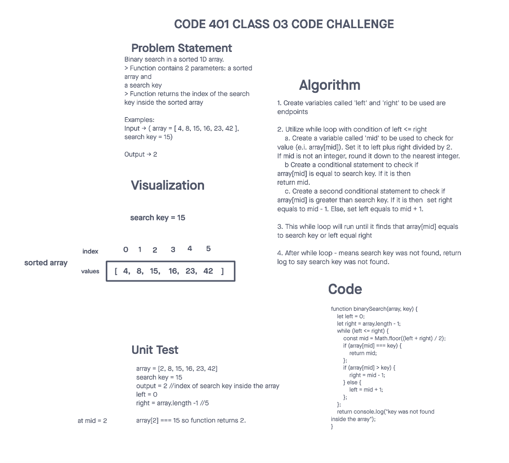

# Challenge Title
## Binary search in a sorted 1D array
> This coding challenge is to create a function called binarySearch that contains 2 parameters: a sorted array and a search key. Function returns the index of the search key inside the sorted array. If search key is not present, tells user that search key was not inside the array.

### Whiteboard Process

### Approach & Efficiency
<!-- What approach did you take? Why? What is the Big O space/time for this approach? -->
> I utilized one while loop and two for loops for this function. The while loop runs until left endpoint is equals to right endpoint. Left and right endpoints adjust depending on where the value at index mid. If value at index mid is equals to the search key, function returns that mid index. Else, returns not found

* The space complexity is O(1) and time complexity is O(log n). I got help from ChatGPT for determining the complexity as im not familiar with it yet.

### Solution
<!-- Show how to run your code, and examples of it in action -->
> Not applicable as the coding challenge only asked to **whiteboard only**
