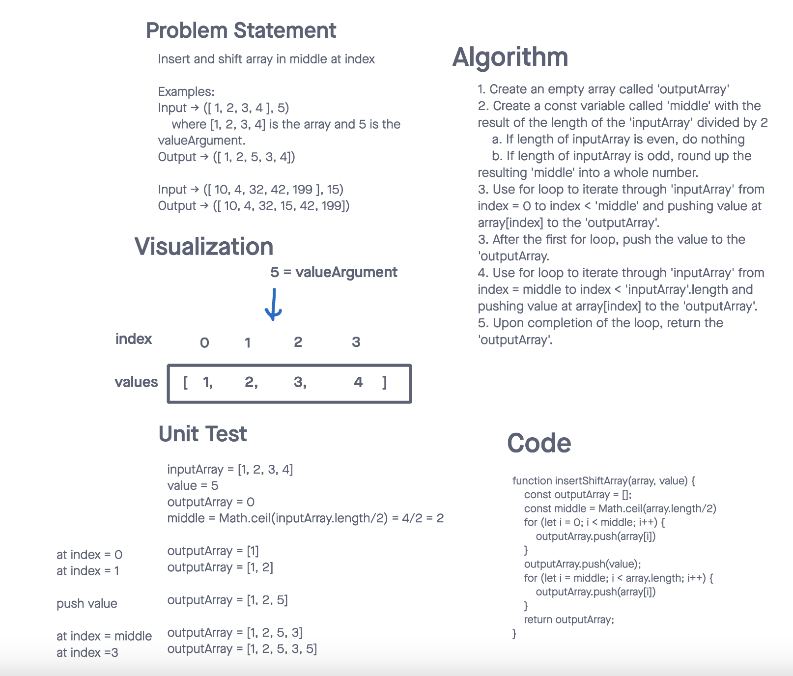

# Challenge Title
## Insert and shift array in middle at index
> This coding challenge is to create a function called insertShiftArray which takes an array and a value as arguments. This function cannot use built-in methods. This function will return an array with the new value added at the middle index.

### Whiteboard Process

### Approach & Efficiency
<!-- What approach did you take? Why? What is the Big O space/time for this approach? -->
> I utilized two for loops for this function. The first loop iterated from 0 to just before the middle number - array.length/2. Push the value. Then the second for loop iterated from middle number to just before array.length. This function will return an array that insert a value in the middle of the array.
> The space complexity is O(n) and time complexity is O(n).

### Solution
<!-- Show how to run your code, and examples of it in action -->
> Not applicable as the coding challenge only asked to **whiteboard only**
