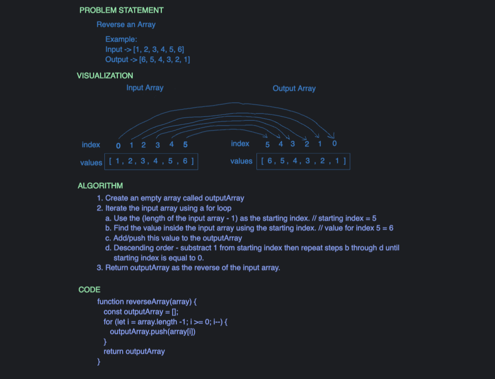

# Challenge Title
## Reverse An Array
> This coding challenge is to create a function called reverseArray which takes an array as an argument. This function cannot use built-in methods. This function will return an array with elements in reversed order.

### Whiteboard Process

### Approach & Efficiency
<!-- What approach did you take? Why? What is the Big O space/time for this approach? -->
> I utilized a for loop that iterated the input array at a descending order starting with the input array length minus 1 as the starting index. The element in this input array was then push inside an empty array until the starting index is equal to 0. This function will return an array in reversed order.
> The space complexity is O(n) and time complexity is O(n).

### Solution
<!-- Show how to run your code, and examples of it in action -->
> Not applicable as the coding challenge only asked to **whiteboard only**
