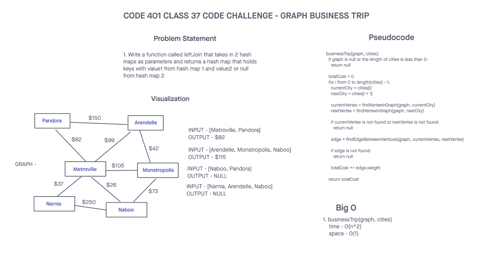
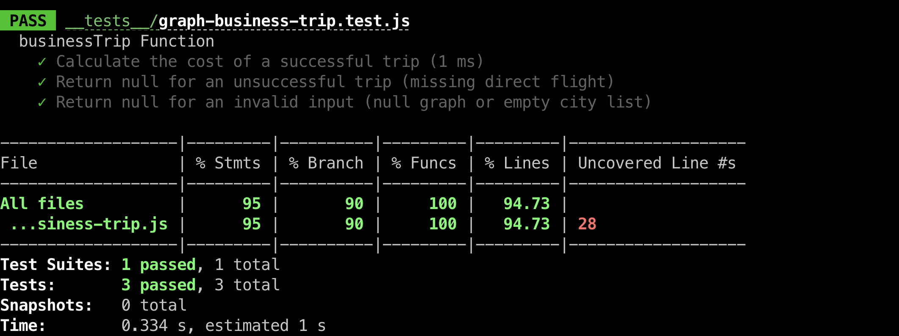

# Challenge Title
## Graph Business Trip
> This coding challenge is to create a function named `graph-business-trip` that takes a graph and an array of city names as arguments and returns the cost of the trip if it's feasible, or null if it's not possible.

### Whiteboard Process


### Approach & Efficiency
<!-- What approach did you take? Why? What is the Big O space/time for this approach? -->

1. graph-business-trip(graph, array)
  * Time Complexity - O(1)
  * Space Complexity - O(1)

### Solution
<!-- Show how to run your code, and examples of it in action -->
[Link to code](https://github.com/cleecoloma/data-structures-and-algorithms/tree/main/javascript/graph-business-trip)

```text
npm test
```

### Test


### Collaborators
Chester Lee Coloma
ChatGTP (tests)
