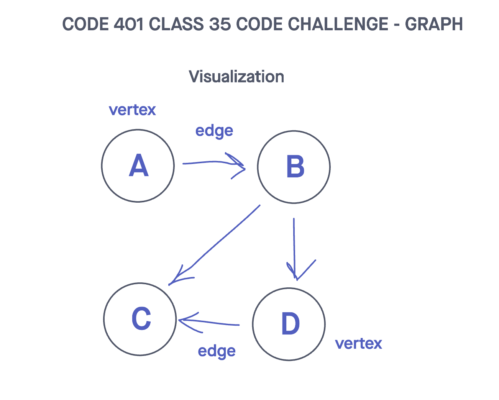
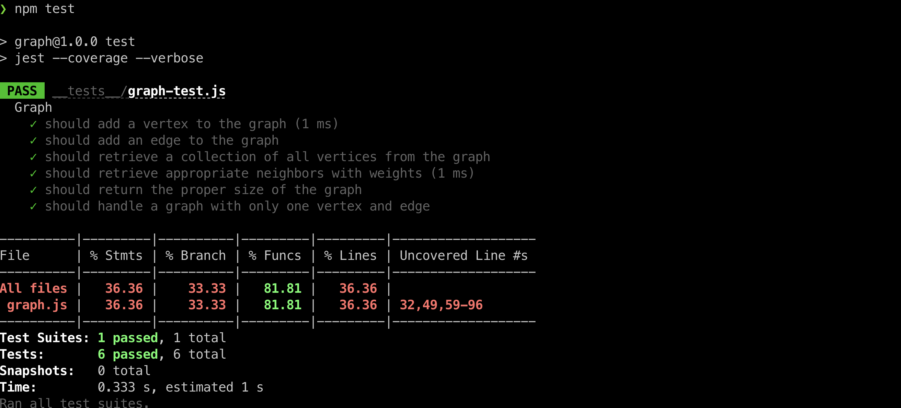

# Challenge Title
## Graph
> This coding challenge is implement graph data structure. The graph should be represented as an adjacency list and should include the following methods: add vertex, add edge, get vertices, get neighbors, and size

### Whiteboard Process


### Approach & Efficiency
<!-- What approach did you take? Why? What is the Big O space/time for this approach? -->

1. addVertex(value)
  * Time Complexity -
  * Space Complexity -
2. addEdge(vertex1, vertex2)
  * Time Complexity -
  * Space Complexity -
3. getVertices()
  * Time Complexity -
  * Space Complexity -
4. getNeighbors(vertex)
  * Time Complexity -
  * Space Complexity -

### Solution
<!-- Show how to run your code, and examples of it in action -->
[Link to code](https://github.com/cleecoloma/data-structures-and-algorithms/tree/main/javascript/graph)

```text
npm test
```

### Test


### Collaborators
Chester Lee Coloma
ChatGTP (tests)
