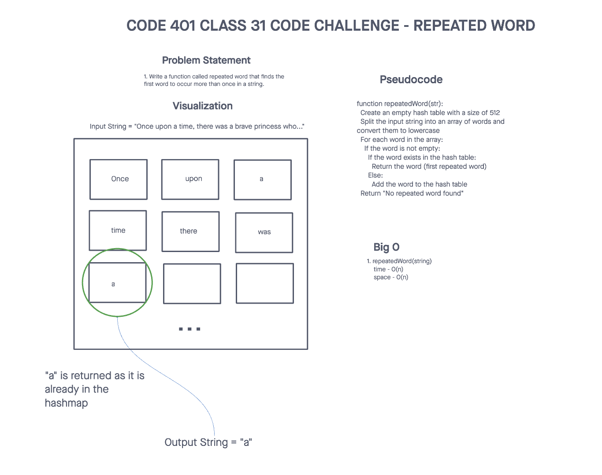
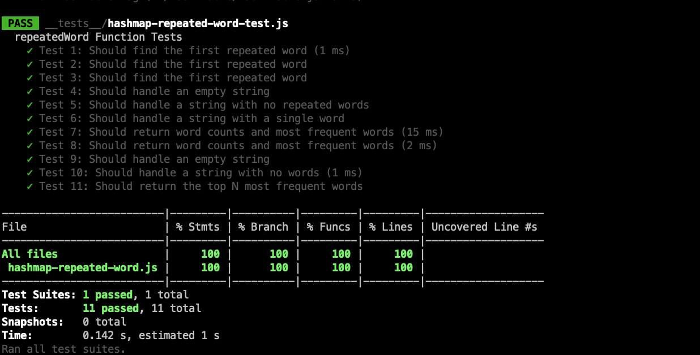

# Challenge Title
## Hash Map Repeated Word
> This coding challenge is to write a function called repeated word that finds the first word to occur more than once in a string.

### Whiteboard Process


### Approach & Efficiency
<!-- What approach did you take? Why? What is the Big O space/time for this approach? -->

1. repeatedWord(string)
  * Time Complexity - O(n)
  * Space Complexity - O(n)
2. wordCountAndMostFrequentWords(key)
  * Time Complexity - O(n log(n))
  * Space Complexity - O(n)

### Solution
<!-- Show how to run your code, and examples of it in action -->
[Link to code](https://github.com/cleecoloma/data-structures-and-algorithms/tree/main/javascript/hashmap-repeated-word)

```text
npm test
```

### Test


### Collaborators
Chester Lee Coloma
ChatGTP (tests)
