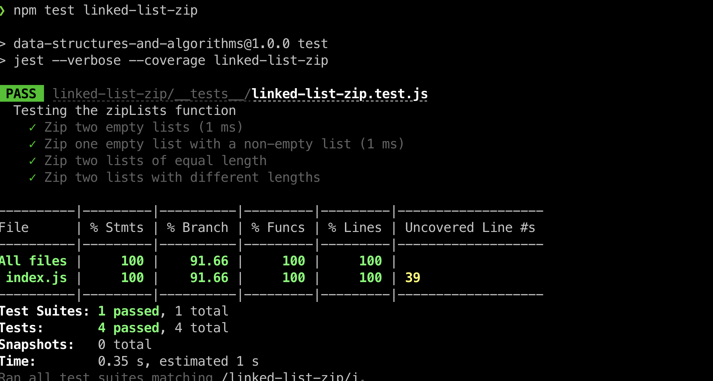

# Challenge Title
## Linked List Zip
> This coding challenge is to create Linked List method - zip. This method zip two linked lists together into one so that the nodes alternate between the two lists and return a reference to the the zipped list.

### Whiteboard Process


### Approach & Efficiency
<!-- What approach did you take? Why? What is the Big O space/time for this approach? -->

1. LinkedList.zip()
  * Time Complexity - O(n) - worst case is traversing the whole linked list 
  * Space Complexity - O(1) - constant even with two pointers as they only occupy a fixed amount of memory.

### Solution
<!-- Show how to run your code, and examples of it in action -->
[Link to code](https://github.com/cleecoloma/data-structures-and-algorithms/blob/main/javascript/linked-list-zip/index.js)
```text
npm test
```



