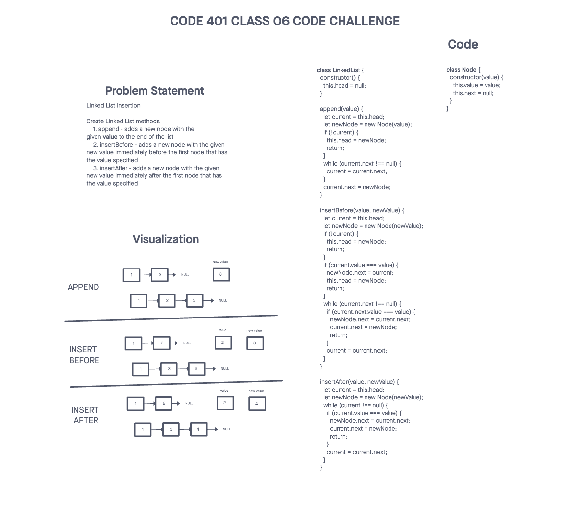
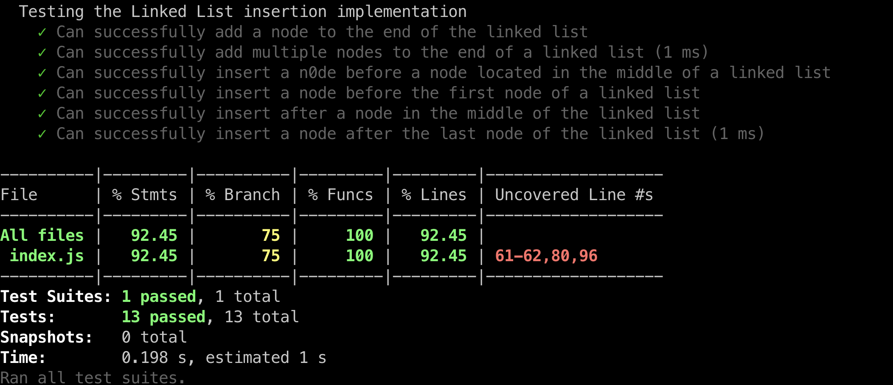

# Challenge Title
## Linked List Implementation
> This coding challenge is to create Node class and Linked List class. Node class has properties for the value in the Node and a pointer to the next Node. Linked List class contains insert - add new node to the head, include - indicates whether value exists as a Node's value somewhere within the list, and toString - returns a string representing all the values in the Linked List.

## Linked List Insertion
> This coding challenge is to create Linked List methods - append, insertBefore, and insertAfter. Append adds a new node with the given value to the end of the list. insertBefore adds a new node with the given new value immediately before the first node that has the value specified. insertAfter adds a new node with the given new value immediately after the first node that has the value specified.

### Whiteboard Process



### Approach & Efficiency
<!-- What approach did you take? Why? What is the Big O space/time for this approach? -->

1. LinkedList.insert()
  * Time Complexity - O(1) - constant as inserts happens in the beginning
  * Space Complexity - O(1) - constant since only creating a new node

2. LinkedList.include()
  * Time Complexity - O(n) - traversing linkedlist from head to node
  * Space Complexity - O(1) - constant as the it doesn't grow with the input size

3. LinkedList.toString()
  * Time Complexity - O(n) -  traversing linkedlist from head to node
  * Space Complexity - O(n) - creating a string that grows linearly with the size of list.

4. LinkedList.append()
  * Time Complexity - O(n) - traversing linkedlist from head to node
  * Space Complexity - O(1) - constant since only creating a single node

5. LinkedList.insertBefore()
  * Time Complexity - O(n) - traversing linkedlist from head to node
  * Space Complexity - O(1) - constant since only creating a single node

6. LinkedList.insertAfter()
  * Time Complexity - O(n) -  traversing linkedlist from head to node
  * Space Complexity - O(1) - constant since only creating a single node

### Solution
<!-- Show how to run your code, and examples of it in action -->
[Link to code](https://github.com/cleecoloma/data-structures-and-algorithms/blob/main/javascript/linked-list/index.js)
```text
npm test
```



