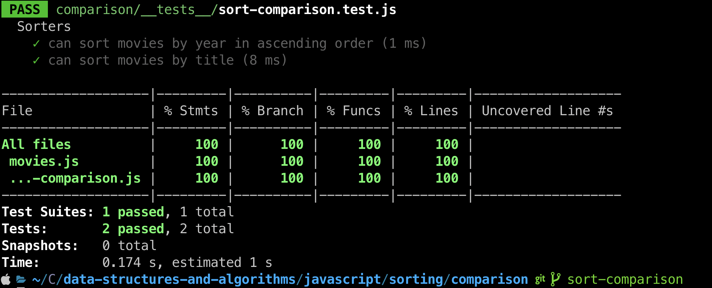

# Challenge Title
## Sort Comparison
> This coding challenge is to implement comparison sort that takes in an array of movie objects and sorts them based on either the year or the title.

### Approach & Efficiency
<!-- What approach did you take? Why? What is the Big O space/time for this approach? -->

1. sortByYear(array)
  * Time Complexity - O(n log n)
  * Space Complexity - O(1)

2. sortByTitle(array)
  * Time Complexity - O(n log n)
  * Space Complexity - O(1)

### Solution
<!-- Show how to run your code, and examples of it in action -->
[Link to code](https://github.com/cleecoloma/data-structures-and-algorithms/tree/main/javascript/sorting/comparison)

```text
npm test
```

### Test


### Collaborators
* Chester Lee Coloma
* ChatGTP (tests)
