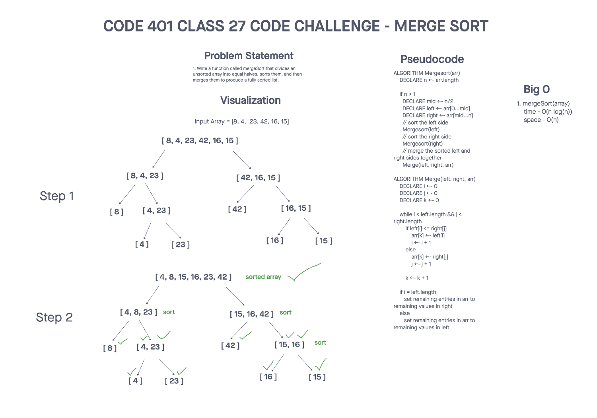
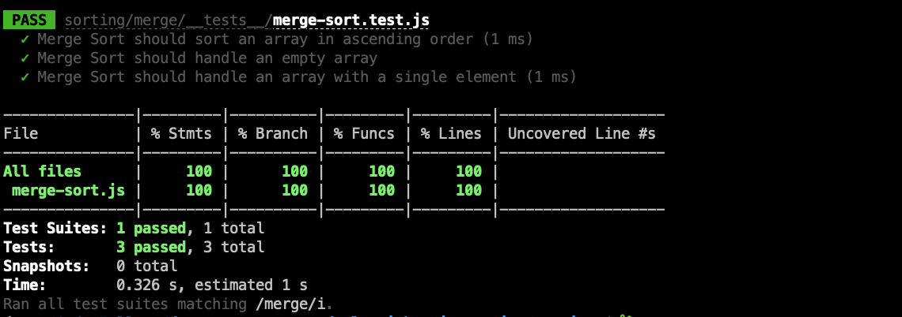

# Challenge Title
## Merge Sort
> This coding challenge is to implement merge sort that divides an unsorted array into equal halves, sorts them, and then merges them to produce a fully sorted list.

### Whiteboard Process


### Approach & Efficiency
<!-- What approach did you take? Why? What is the Big O space/time for this approach? -->

1. insertionSort(array)
  * Time Complexity - O(n log n)
  * Space Complexity - O(n)

### Solution
<!-- Show how to run your code, and examples of it in action -->
[Link to code](https://github.com/cleecoloma/data-structures-and-algorithms/tree/main/javascript/sorting/merge)

```text
npm test
```

### Test


### Collaborators
Chester Lee Coloma
ChatGTP (tests)
