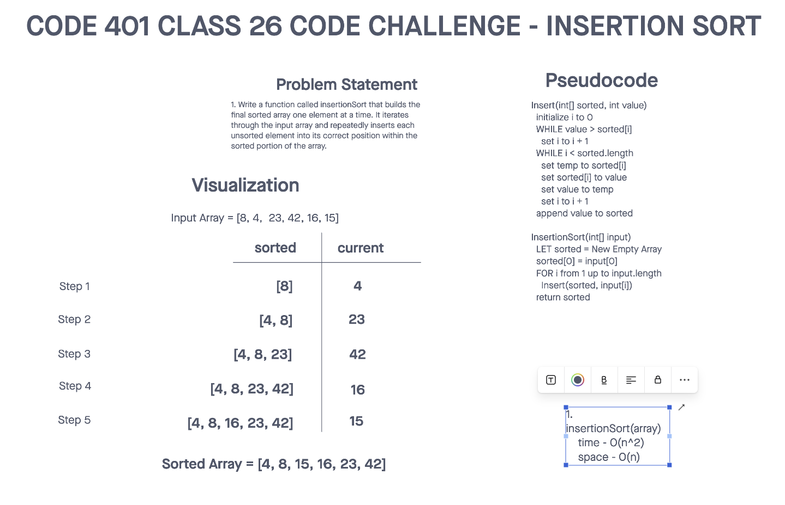

# Challenge Title
## Insertion Sort
> This coding challenge is to implement insertion sort that builds the final sorted array one element at a time. It iterates through the input array and repeatedly inserts each unsorted element into its correct position within the sorted portion of the array.

### Whiteboard Process


### Approach & Efficiency
<!-- What approach did you take? Why? What is the Big O space/time for this approach? -->

1. insertionSort(array)
  * Time Complexity - O(n^2)
  * Space Complexity - O(1)

### Solution
<!-- Show how to run your code, and examples of it in action -->
[Link to code](https://github.com/cleecoloma/data-structures-and-algorithms/tree/main/javascript/sorting/insertion)
```text
npm test
```

### Test


### Collaborators
Chester Lee Coloma
ChatGTP (tests)
