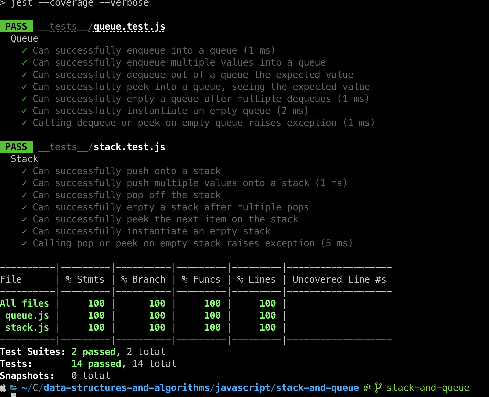

# Challenge Title
## Stack And Queue
> This coding challenge is to utilize a Linked List as the underlying data storage mechanism to implement both a `Stack` and a `Queue.`

### Whiteboard Process


### Approach & Efficiency
<!-- What approach did you take? Why? What is the Big O space/time for this approach? -->

1. Stack.push()
  * Time Complexity - O(1) - adds a new node to the top of the stack.
1. Queue.enqueue()
  * Time Complexity - O(1) - adds a new node to the back of the queue.

### Solution
<!-- Show how to run your code, and examples of it in action -->
[Link to code](https://github.com/cleecoloma/data-structures-and-algorithms/blob/main/javascript/linked-list-zip/index.js)
```text
npm test
```


