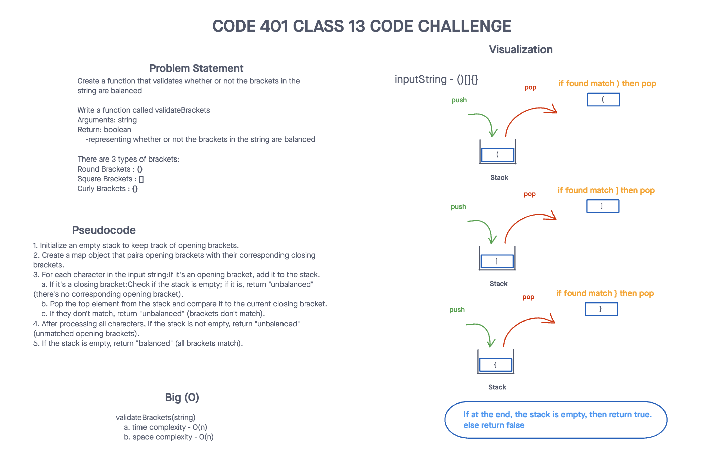
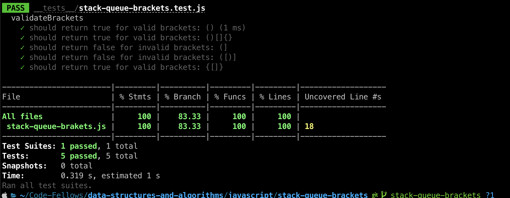

# Challenge Title
## Stack Queue Brackets
> This coding challenge is to create a function that validates whether or not the brackets in the string are balanced.

### Whiteboard Process


### Approach & Efficiency
<!-- What approach did you take? Why? What is the Big O space/time for this approach? -->

1. validateBrackets(string)
  * Time Complexity - O(n)
  * Space Complexity - O(n)

### Solution
<!-- Show how to run your code, and examples of it in action -->
[Link to code](https://github.com/cleecoloma/data-structures-and-algorithms/tree/main/javascript/stack-queue-brackets)
```text
npm test
```


