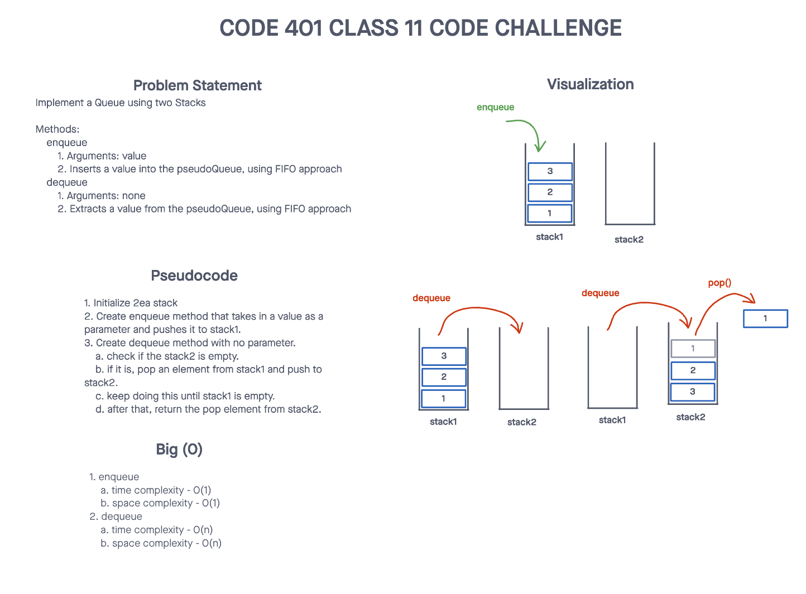
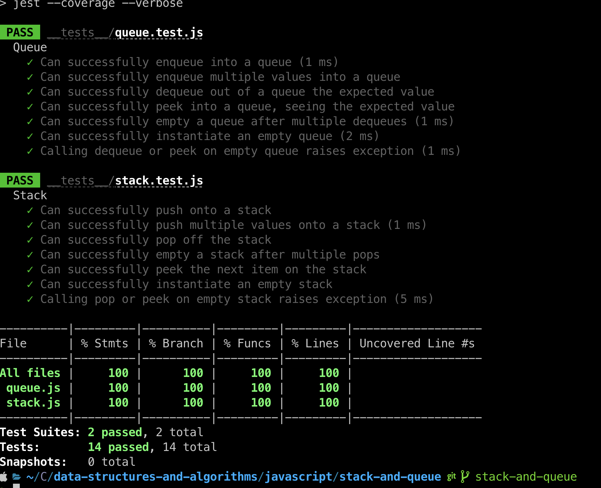

# Challenge Title
## Stack Queue Pseudo
> This coding challenge is to implement a `Queue` using two `Stacks`.

### Whiteboard Process


### Approach & Efficiency
<!-- What approach did you take? Why? What is the Big O space/time for this approach? -->

1. Enqueue(value)
  * Time Complexity - O(1)
  * Space Complexity - O(1)
1. Dequeue()
  * Time Complexity - O(n)
  * Space Complexity - O(n)

### Solution
<!-- Show how to run your code, and examples of it in action -->
[Link to code](https://github.com/cleecoloma/data-structures-and-algorithms/tree/main/javascript/stack-queue-pseudo)
```text
npm test
```


