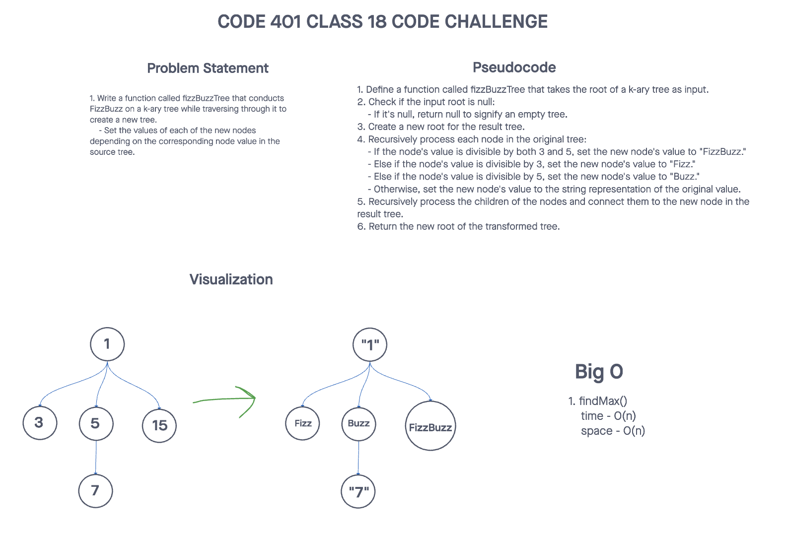
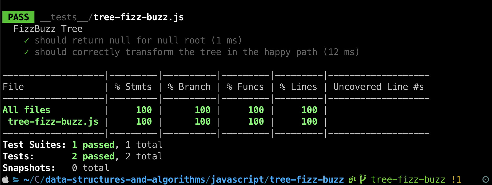

# Challenge Title
## Tree Fizz Buzz
> This coding challenge is to conduct “FizzBuzz” on a k-ary tree while traversing through it to create a new tree. Set the values of each of the new nodes depending on the corresponding node value in the source tree.

### Whiteboard Process


### Approach & Efficiency
<!-- What approach did you take? Why? What is the Big O space/time for this approach? -->

1. fizzBuzzTree(tree)
  * Time Complexity - O(n)
  * Space Complexity - O(n)

### Solution
<!-- Show how to run your code, and examples of it in action -->
[Link to code](https://github.com/cleecoloma/data-structures-and-algorithms/tree/main/javascript/tree-fizz-buzz)
```text
npm test
```

### Test


### Collaborators
Chester Lee Coloma
ChatGTP (tests)
