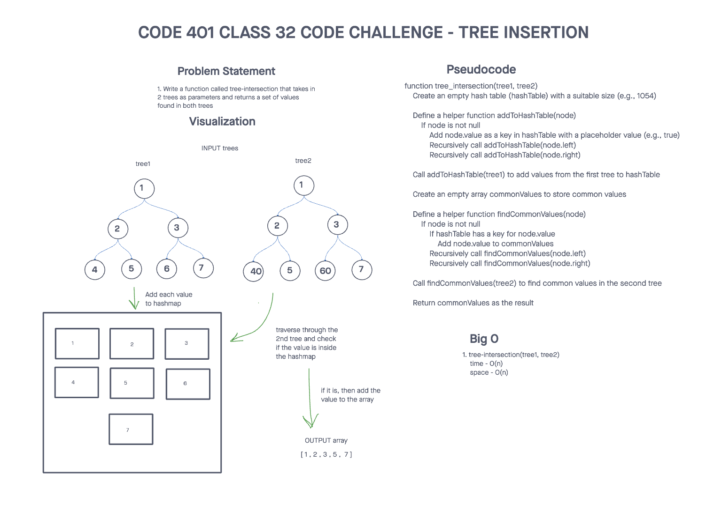
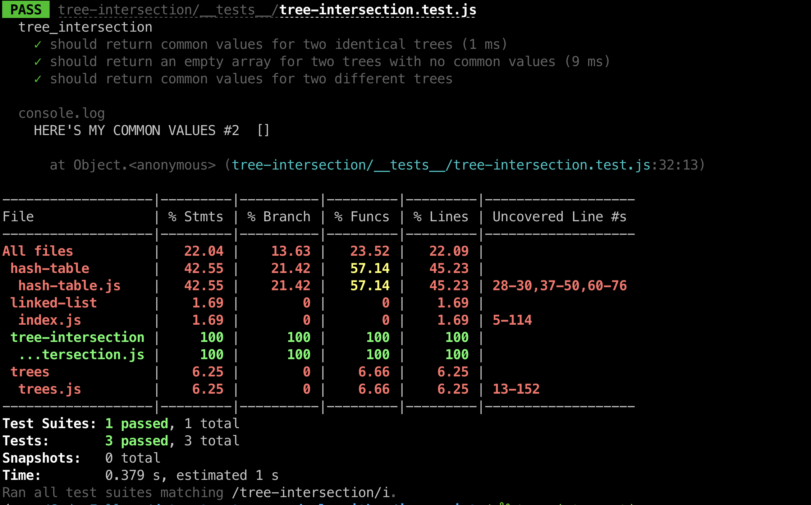

# Challenge Title
## Tree Intersection
> This coding challenge is to write a function that takes in two binary trees as parameters and returns a set of values that are found in both trees.

### Whiteboard Process


### Approach & Efficiency
<!-- What approach did you take? Why? What is the Big O space/time for this approach? -->

1. tree-intersection(tree1, tree2)
  * Time Complexity - O(n)
  * Space Complexity - O(n)

### Solution
<!-- Show how to run your code, and examples of it in action -->
[Link to code](https://github.com/cleecoloma/data-structures-and-algorithms/tree/main/javascript/tree-intersection)

```text
npm test
```

### Test


### Collaborators
Chester Lee Coloma
ChatGTP (tests)
