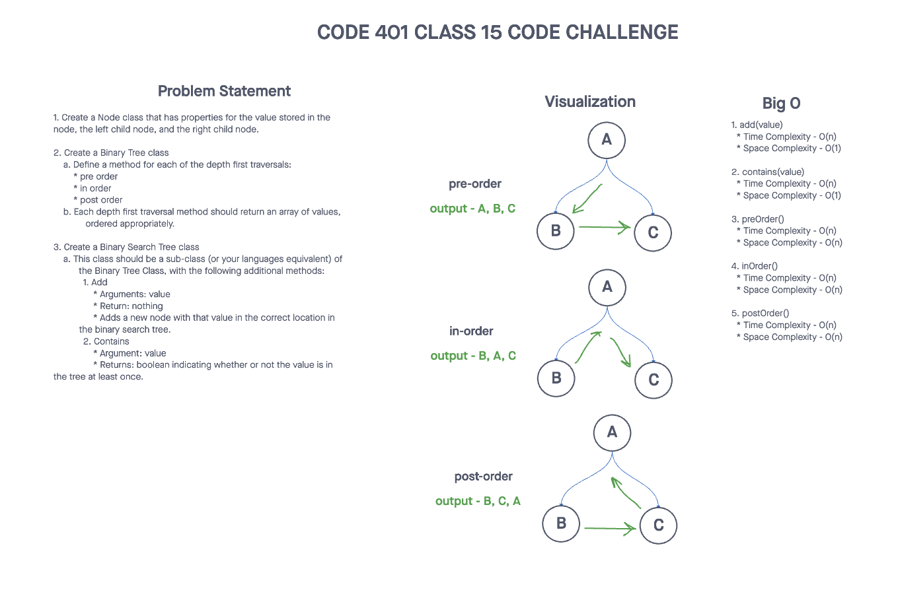
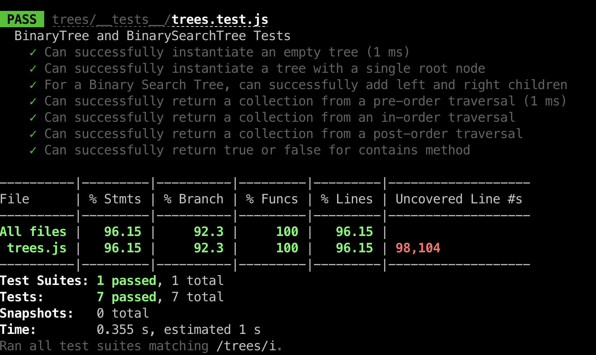
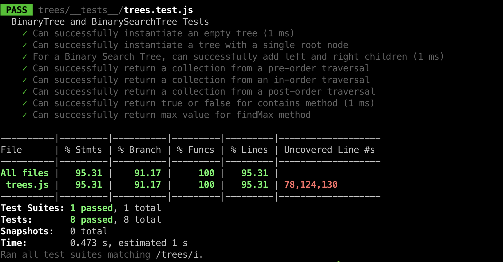

# Challenge Title
## Trees
> This coding challenge is to implement tress. Create Node, Binary Tree, and Binary Search Tree.

### Whiteboard Process



### Approach & Efficiency
<!-- What approach did you take? Why? What is the Big O space/time for this approach? -->

1. add(value)
  * Time Complexity - O(n)
  * Space Complexity - O(1)

2. contains(value)
  * Time Complexity - O(n)
  * Space Complexity - O(1)

3. preOrder()
  * Time Complexity - O(n)
  * Space Complexity - O(n)

4. inOrder()
  * Time Complexity - O(n)
  * Space Complexity - O(n)

5. postOrder()
  * Time Complexity - O(n)
  * Space Complexity - O(n)

5. findMax()
  * Time Complexity - O(n)
  * Space Complexity - O(n)

### Solution
<!-- Show how to run your code, and examples of it in action -->
[Link to code](https://github.com/cleecoloma/data-structures-and-algorithms/tree/main/javascript/trees)
```text
npm test
```

1. 
2. 

### Collaborators
Chester Lee Coloma
ChatGTP (tests)
